# Juan Ángel Quintero Roldán

### Software Developer | ADSO

Estudiante de Tecnología en Análisis y Desarrollo de Software en el SENA, interesado en el desarrollo de aplicaciones y soluciones digitales.

---

## Sobre mí

Soy desarrollador de software en formación y actualmente estudio **Tecnología en Análisis y Desarrollo de Software (ADSO) en el SENA**.

Me interesa crear aplicaciones, aprender nuevas tecnologías y mejorar mis habilidades mediante proyectos prácticos. Disfruto trabajar en la construcción de soluciones desde la idea inicial hasta su implementación.

Actualmente estoy buscando una **oportunidad de patrocinio empresarial** que me permita continuar mi formación, adquirir experiencia y participar en proyectos reales de desarrollo de software.

---

## Tecnologías

---

## Proyectos

### Anjuroela Tutor

Aplicación enfocada en aprendizaje y apoyo educativo.

**Stack:** `Python` · `JavaScript` · `HTML` · `CSS` ·  

---

### Anjuroela Fit

Aplicación enfocada en fitness y seguimiento de actividades.

**Stack:** `TypeScript` · `Expo` · `node` · `movil`

---

## Formación

**Tecnología en Análisis y Desarrollo de Software — SENA**

Actualmente en formación, desarrollando conocimientos y competencias en:

* Programación
* Desarrollo de aplicaciones
* Desarrollo web
* Bases de datos
* Análisis de requerimientos
* Diseño y desarrollo de software
* Git y control de versiones

---

## Actualmente aprendiendo

* Python
* JavaScript
* TypeScript
* Desarrollo web
* Desarrollo de aplicaciones con Expo
* Buenas prácticas de desarrollo de software

---

## GitHub Statistics

---

## Contribution Activity

---

## Contact

---

**Thanks for visiting my profile.**

